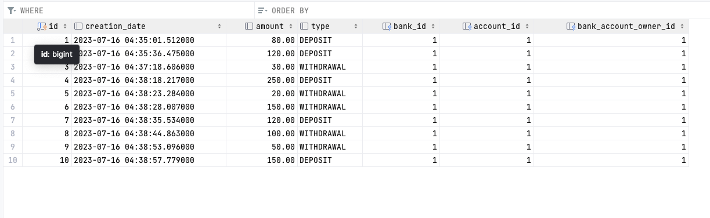

# SEKOM PROJECT 
## BANKA SİSTEMİ UYGULAMASI
<hr>
Proje bir banka uygulamasının genel hatlarıyla simülasyonunu yapar.

### Entity Classlari
#### Bank
id -> Long

bankName -> String

bankAccounts -> Set[BankAccountEntity]

transactions -> List[TransactionEntity]

#### BankAccount

id -> Long

accountNumber -> String

balance -> BigDecimal

bankAccountOwner -> BankAccountOwnerEntity

bank -> BankEntity

transactions -> List[TransactionEntity]

#### BankAccountOwner

id -> Long

firstName -> String

lastName -> String

identityNumber -> String

uniqueAccountOwnerNumber -> UUID

communicationInformation -> CommunicationInformationEntity

bankAccount -> List[BankAccountEntity]

#### CommunicationInformation

id -> Long

email -> String

phoneNumber -> String 

bankAccountOwner -> BankAccountOwnerEntity


<hr>

<br>

### PROJE NASIL ÇALIŞIR

Proke dockerize edilmiştir.<br>
<i>8080</i> ve <i>5432</i> portları kullanım dışı olmalıdır.
<br>
<b>Projenin kök dizininde olunduğundan emin olunmalıdır.</b>
```
docker-compose up db -d
mvn package
docker-compose down
docker-compose up
```

<hr>

Bu şekilde proje ayağa kalkacaktır.

### TEST

Yukarıdaki docker komutları çalıştırıldıktan sonra tarayıcıdan<br>
<i>localhost:8080/</i><br>
endpointine istek atıldığı zaman Hi yazısı görülmelidir.

<hr>

### REQUESTS

* Öncelikle Banka Oluşturulmalıdır.

```
Endpoint: localhost:8080/bank/
Request Method: Post
Payload:
{
    "bankName": "ING"
}
```

Sonuç olarak
```
{
    "httpStatus": "CREATED",
    "statusCode": 201,
    "message": "Create New Bank with Successfully.!",
    "data": {
        "bankName": "ING"
    }
}
```

Eğer aynı bankadan bir tane daha oluşturulmaya çalışılırsa Already Exist hatası alınır.<br>
```
{
    "httpStatus": "CONFLICT",
    "statusCode": 409,
    "message": "Already Exist.!",
    "localDateTime": "2023-07-16T04:10:45.713799",
    "errorInfoMap": {
        "Request URL": "http://localhost:8080/bank/",
        "Endpoint": "/",
        "Request URI": "/bank/",
        "HTTP Method": "POST"
    }
}
```

* Bank Account Owner oluşturulmalıdır.

```
Endpoint: localhost:8080/bankAccountOwner/
Request Method: Post
Payload:
{
    "firstName": "Furkan",
    "lastName": "Kulaksiz",
    "identityNumber": "12345678911",
    "communicationInformation": {
        "phoneNumber": "+905534664699",
        "email": "fsk@gmail.com"
    }
}
```

Sonuç olarak
```
{
    "httpStatus": "CREATED",
    "statusCode": 201,
    "message": "Create New Bank Account Owner.!",
    "data": {
        "name": "Furkan",
        "surname": "Kulaksiz",
        "email": "fsk@gmail.com",
        "phoneNumber": "+905534664699",
        "uniqueBankAccountOwner": "76a22f02-9374-4bb3-b6f0-9a1ab3c29b4c",
        "bankAccount": "Bilgi yok"
    }
}
```

Constraintler:
Email hariç gönderilen bütün değerler dolu olmak zorunda. <br>
identityNumber, phoneNumber ve email unique olmak zorunda. <br>
Email için validasyon bulunmakta.<br>
Phone Number için validasyon bulunmakta. (13 Karakter)<br>
Identity Number için validasyon bulunmakta. (13 Karakter)<br>
<br><br>
Requestler ve Response'lar aşağıdadır.<br>
Aynı Request atıldığı zaman, Already Exists.! hatası alınır çünkü kişi DB'de kayıtlıdır.
```
{
    "httpStatus": "CONFLICT",
    "statusCode": 409,
    "message": "Already Exist.!",
    "localDateTime": "2023-07-16T04:16:53.365262",
    "errorInfoMap": {
        "Request URL": "http://localhost:8080/bankAccountOwner/",
        "Endpoint": "/",
        "Request URI": "/bankAccountOwner/",
        "HTTP Method": "POST"
    }
}
```
Valide olmayan bir email ile request atılırsa,
```
{
    "firstName": "Furkan Sahin",
    "lastName": "Kulaksiz",
    "identityNumber": "12345678911",
    "communicationInformation": {
        "phoneNumber": "+905534664698",
        "email": "fskasd"
    }
}
```
Sonuç
```
{
    "httpStatus": "BAD_REQUEST",
    "statusCode": 400,
    "message": "fskasd This Email is Not Valid.!",
    "localDateTime": "2023-07-16T04:18:45.322845",
    "errorInfoMap": {
        "Request URL": "http://localhost:8080/bankAccountOwner/",
        "Endpoint": "/",
        "Request URI": "/bankAccountOwner/",
        "HTTP Method": "POST"
    }
}
```
* Bank Account oluşturulur. Burada Bank Account Owner create edildikten sonra responsedan gelen <i>uniqueBankAccountOwner</i> değeri kullanılır.
  
```
Endpoint: localhost:8080/bankAccount/
Request Method: POST
Payload:
{
    "bankAccountOwner": {
        "uniqueAccountOwnerNumber": "76a22f02-9374-4bb3-b6f0-9a1ab3c29b4c"
    },
    "bank": {
        "bankName": "ING"
    }
}
```

Sonuç olarak

```
{
    "httpStatus": "CREATED",
    "statusCode": 201,
    "message": "Create New Bank with Successfully.!",
    "data": {
        "bankAccountNumber": "IN57967779240980656195",
        "bankInfo": {
            "bankName": "ING"
        },
        "balance": 0
    }
}
```

Eğer requestte DB'de olmayan bir banka adı ya da uniqueAccountOwnerNumber verilirse hata döner.

UniqueAccountOwnerNumber değiştirilerek istek gönderilirse;
```
{
    "bankAccountOwner": {
        "uniqueAccountOwnerNumber": "76a22f02-9374-4bb3-b6f0-9a1ab3c29b4c"
    },
    "bank": {
        "bankName": "ING"
    }
}

```

Sonuç

```
{
    "httpStatus": "NOT_FOUND",
    "statusCode": 404,
    "message": "de7c4383-ee0b-49f2-88dc-9f969b0fc598 The unique account owner key that you provided as a parameter could not locate an account owner,\nor the account owner has not yet created a record in any existing bank.\n",
    "localDateTime": "2023-07-16T04:23:19.264761",
    "errorInfoMap": {
        "Request URL": "http://localhost:8080/bankAccount/",
        "Endpoint": "/",
        "Request URI": "/bankAccount/",
        "HTTP Method": "POST"
    }
}

```

DB'de olmayan bir Banka Name ile Request gönderilirse,
```
{
    "bankAccountOwner": {
        "uniqueAccountOwnerNumber": "76a22f02-9374-4bb3-b6f0-9a1ab3c29b4c"
    },
    "bank": {
        "bankName": "Garanti"
    }
}
```

Sonuç
```
{
    "httpStatus": "NOT_FOUND",
    "statusCode": 404,
    "message": "Garanti Bank Not Found.!",
    "localDateTime": "2023-07-16T04:27:19.324855",
    "errorInfoMap": {
        "Request URL": "http://localhost:8080/bankAccount/",
        "Endpoint": "/",
        "Request URI": "/bankAccount/",
        "HTTP Method": "POST"
    }
}
```

* Banka hesabı para yükleme/çekme endpointlerine geçilir.
Bank Account endpointinden gelen accountNumber ve uniqueAccountOwnerNumber ile istek atılır.
```
Endpoint: localhost:8080/bankAccount/operation
Request Method: POST
{
    "bank": {
        "bankName": "ING"
    },
    "bankAccount": {
        "accountNumber": "IN29016292222464185278",
        "balance": 80
    },
    "bankAccountOwner": {
        "uniqueAccountOwnerNumber": "083faa14-1ae4-4f00-950c-edd0435c30c6"
    },
    "transactionType": "DEPOSIT"
}
```

Sonuç olarak

```
{
    "httpStatus": "OK",
    "statusCode": 200,
    "message": "Deposit Operation Finished Successfully.!",
    "data": {
        "bankAccountNumber": "IN57967779240980656195",
        "bankInfo": {
            "bankName": "ING"
        },
        "balance": 80.00
    }
}
```

Balance değeri 120 yapılıp bir request daha atılırsa,
```
{
    "bank": {
        "bankName": "ING"
    },
    "bankAccount": {
        "accountNumber": "IN57967779240980656195",
        "balance": 120
    },
    "bankAccountOwner": {
        "uniqueAccountOwnerNumber": "76a22f02-9374-4bb3-b6f0-9a1ab3c29b4c"
    },
    "transactionType": "DEPOSIT"
}
```

Sonuç
```
{
    "httpStatus": "OK",
    "statusCode": 200,
    "message": "Deposit Operation Finished Successfully.!",
    "data": {
        "bankAccountNumber": "IN57967779240980656195",
        "bankInfo": {
            "bankName": "ING"
        },
        "balance": 200.00
    }
}
```

Transaction Type'ı WIHTDRAWAL yapıp request attığımızda
```
{
    "bank": {
        "bankName": "ING"
    },
    "bankAccount": {
        "accountNumber": "IN57967779240980656195",
        "balance": 30
    },
    "bankAccountOwner": {
        "uniqueAccountOwnerNumber": "76a22f02-9374-4bb3-b6f0-9a1ab3c29b4c"
    },
    "transactionType": "WITHDRAWAL"
```

sonuç olarak
```
{
    "httpStatus": "OK",
    "statusCode": 200,
    "message": "Deposit Operation Finished Successfully.!",
    "data": {
        "bankAccountNumber": "IN57967779240980656195",
        "bankInfo": {
            "bankName": "ING"
        },
        "balance": 170.00
    }
}
```

* Geçmişi Sorgulama
Unique Account Owner Id, Banka Adı, Bank Account Number, Hangi işlem için (DEPOSIT, WITHDRAWAL) ve Date bilgisi sorgulama yapılırsa ekrana veriler gelir.

```
Endpoint: localhost:8080/operationsDate/
Request Method: POST
{
    "bank": {
        "bankName": "ING"
    },
    "bankAccount": {
        "accountNumber": "Ga41913932245159836339"
    },
    "bankAccountOwner": {
        "uniqueAccountOwnerNumber": "083faa14-1ae4-4f00-950c-edd0435c30c6"
    },
    "transactionType": "DEPOSIT",
    "date": "2023-07-17"
}
```

Sonuç Olarak
```
{
    "httpStatus": "CREATED",
    "statusCode": 201,
    "message": "All Deposit History",
    "data": [
        {
            "balance": 150.00,
            "createdDate": "2023-07-16 04:38:57.779"
        },
        {
            "balance": 50.00,
            "createdDate": "2023-07-16 04:38:53.096"
        },
        {
            "balance": 100.00,
            "createdDate": "2023-07-16 04:38:44.863"
        },
        {
            "balance": 120.00,
            "createdDate": "2023-07-16 04:38:35.534"
        },
        {
            "balance": 150.00,
            "createdDate": "2023-07-16 04:38:28.007"
        },
        {
            "balance": 20.00,
            "createdDate": "2023-07-16 04:38:23.284"
        },
        {
            "balance": 250.00,
            "createdDate": "2023-07-16 04:38:18.217"
        },
        {
            "balance": 30.00,
            "createdDate": "2023-07-16 04:37:18.606"
        },
        {
            "balance": 120.00,
            "createdDate": "2023-07-16 04:35:36.475"
        },
        {
            "balance": 80.00,
            "createdDate": "2023-07-16 04:35:01.512"
        }
    ]
}
```

WITHDRAWAL ile işlem yaparsak
```
Endpoint: localhost:8080/operationsDate/
Request Method: POST
{
    "bank": {
        "bankName": "ING"
    },
    "bankAccount": {
        "accountNumber": "IN57967779240980656195"
    },
    "bankAccountOwner": {
        "uniqueAccountOwnerNumber": "76a22f02-9374-4bb3-b6f0-9a1ab3c29b4c"
    },
    "transactionType": "WITHDRAWAL",
    "date": "2023-07-17"
}
```

sonuç olarak
```
{
    "httpStatus": "CREATED",
    "statusCode": 201,
    "message": "All Withdrawal History",
    "data": [
        {
            "balance": 50.00,
            "createdDate": "2023-07-16 04:38:53.096"
        },
        {
            "balance": 100.00,
            "createdDate": "2023-07-16 04:38:44.863"
        },
        {
            "balance": 150.00,
            "createdDate": "2023-07-16 04:38:28.007"
        },
        {
            "balance": 20.00,
            "createdDate": "2023-07-16 04:38:23.284"
        },
        {
            "balance": 30.00,
            "createdDate": "2023-07-16 04:37:18.606"
        }
    ]
}
```

### ÇOK ÖNEMLİ NOT:
#### Bütün requestler validasyon ile kontrol edilmiştir.

<hr>

### TRANSACTION

<b>Transaction management için <i>AspectJ</i> ile Transaction Aspecti yazılmıştır.</b>




<hr>

### GLOBAL EXCEPTION HANDLING

<hr>

<b>Global Exception Handling için TAMAMEN GENERIC olarak bir yapı kurgulanmıştır.</b><br>
<b>INTERCEPTORLAR ile requestler alınmıştır ve bu requestin içerisinden gelen bilgiler ile hata mesajları dönülmüştür.</b>


### QUEUE

<hr>

<b>Aynı anda birden falza Request atılması için Node.JS kodu yazılmıştır. Bunun için CORS ayarı yapılmıştır. Bu kurgu için queue mekanizması düşünülmüştür.<br>
RabbitMQ entegre edilmiştir fakat hata alındığı için projeden kaldırılmıştır.<br>
"rabbitmq-entegration" branchına commit atılmıştır fakat PR kabul edilmemiştir.</b>

<hr>


## EKSİKLER
* RabbitMQ entegrasyonu yapılamamıştır.
* UnitTest'ler yazılabilirdi.
* Dokümantasyon ve manuel testler için Swagger eklenebilirdi.
* Kod tekrarları mevcuttur.
* Bazı yerlerde DB'ye fazla kayıt atıldığı için Redis gibi cache aracı kullanılabilirdi.
* Authentication yapılabilirdi.


